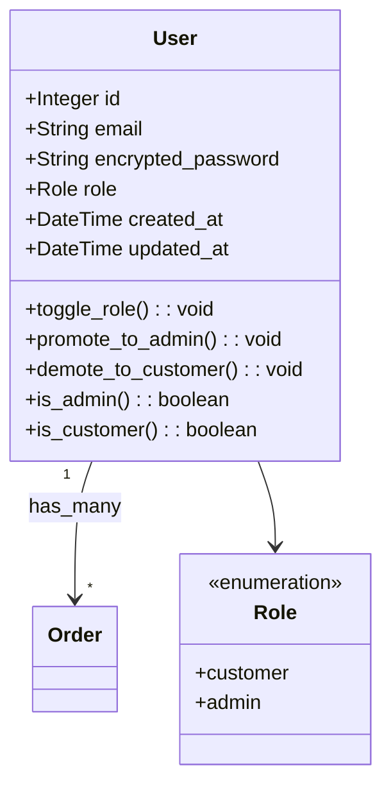

# SaltShop

An Ecommerce Platform heavily inspired by the shopify way of development.

---

## Architectural Diagrams

[![](https://mermaid.ink/img/pako:eNqNWG1v2zYQ_iuCig4tkMR2bMexMBRInHbrkGxenHbAnH2gJdoWIpMGKSVNg_z38U3kSaSS-INB8p7jy3N35GM_xSnNcJzEG4b22-jm_JZE4sOrlR64jWdFjkkZXaJHzG5jbZafc0YfOGbLf_Cqbv_nrJ93KC-061K1I90xEEyyW-ItNWeYCwwqc0r0gtFhdC2cefQ9xw8cLv873WE5uJSN3iUiWU420RxtMNjFnNGsSkuFM-1ohkpU0A1AzRDTkMWW7vdyGjkCAVuc3tFKg-pO9KWgDwD0F8swUwjViq4QEZvZuTPLz1m2y8kF4tsVRSxbqm5k-wD4TdB5VpXb5SXd5KR3jTc5L5liBqCuBDd6UW5YvsG7fYFKzF8k-my_L_I0xPOMkpLRQszqsT0rWaHYdhifagUybR4ESm4VSja6IV9LvLMw2emAmmhoqOmEoSosCqdaYdACcy5YUTDTDgNlgBRKNjr2VvFS0KVhdScMdS0YJZUdf6Id5nuUYhiPRi6p-VUvSWwuBZexbjBaxvPFoKk06s6nBWb3eYr9SwIkms7VpTfy64r1PunkNdN4Cf4HXdX5fY7Suw2jFckiOfpilp9XPCcihpGsodQm-pW48IpGdssQqjhqm9qRLD5Ru3WV_BJd08JWFYyujSxwtkOC1LU4QfsGUAvaFnBcYEl8T0fed5Z7WMov4HJ9fjbz69Bedw74ldyLA1H22Ko0VWGNPai09y5BU4e2IOF55QyXguxIVWq76Oob0eJ1X2wxlWuRTdtBrWNbnmNwpXAJpWV-j6OFOLa4jAOhVyFZnBd0tdRYA00SOabW_JJLvnGJMvFytItpcVaWKN3Ka749gbOoaea0eNxRtt_KVMzJHfem-o5Yjvx5zPA1TinLdCR38jBmnL-9TC_EAfwanVNebhhe_H25_ODa0WCi1pI-K8TxR5iGOMv5TBwOLz-odqQ6MHt4T5bnxxfr8_OPEjOCbN03AiNZNxQsZwWtsjqIepVh7-xnxXDvt9nCUcJFmUo_SMni6ma-lF9qlcZ1c4ELwbOtB7DJ9--NXIlKaqQHAZonOjz8ZAWIbwGqwzfWYiNgASrDt1p54ZuaosK311pCW4Ayiw6PhBmICHB-1ZfHh4qAQOVlWZCviDaBk0MmHKA-vaXiBVOtAIwZsNOgy0EsRY4wZ6xJUDbwyges9dOuTU12m4S_jmow4JLLcSopNtcSgUoL8tcgN2ysubTsueGaxwaxTVJDnm2T4rPD5j3qICChCZqGDm8QJBsWF63XhusnOGCyD2_IFt4LlHKB6RsJ4QfHNwMu2mnSdLcpo3djbm8S1FbK0ymm11HgZnNuukDEhQkXlwkqrv1CzcO3-Z477pSDFCWtIT8CIfatVGqlHxyGqSeVRiCRa03ica8Vg53FuTh5EY7Xt9Z1DuhoqYoAL7X6UgcGGqHNhWdqnNs3N3fm25U27HAFIwYiJU5tlG0zbIRFO_7qqgISonkUpxwCB2kbWwS3rPYQbQNk1VuvToyQwYW5ZXTZEbR0-gG-fFOLZx9gCA5a3RshJRWkulWiToSFr0to78pcEdBahHnnAgIMTNBUTmZlqa6UlADawuq98lFEs5Yj4vdMkbzDg_V4vYZ2KEq6MECbashweDKZDg5SWlCWvFs30e74Bp2lw9PjrAMNDmvg6_V02u9DjDqmNvb7q35zAv-a1cg07YtPx6qG7TchQVK9CV_nWAc4PohFcQrWsziJn6TrbSx-8O7wbZyIZobYnVTjzwKHqpIuHkkaJyWr8EEsfn1vtnGyRgUXvWovfhbhixwJVb-rIXtE_qUUduPkKf4RJ4eD0enkaHgynp6OJtP-4KR_chA_xslgcDQZjkfHg9PpYDg4Ho5Png_in2qK46PJ8ag_7vdH4_5gODqeTA7iDZP7NtsRul08zLQipQCfCKuIvAjllf5fU_29-fw_CF287w?type=png)](https://mermaid.live/edit#pako:eNqNWG1v2zYQ_iuCig4tkMR2bMexMBRInHbrkGxenHbAnH2gJdoWIpMGKSVNg_z38U3kSaSS-INB8p7jy3N35GM_xSnNcJzEG4b22-jm_JZE4sOrlR64jWdFjkkZXaJHzG5jbZafc0YfOGbLf_Cqbv_nrJ93KC-061K1I90xEEyyW-ItNWeYCwwqc0r0gtFhdC2cefQ9xw8cLv873WE5uJSN3iUiWU420RxtMNjFnNGsSkuFM-1ohkpU0A1AzRDTkMWW7vdyGjkCAVuc3tFKg-pO9KWgDwD0F8swUwjViq4QEZvZuTPLz1m2y8kF4tsVRSxbqm5k-wD4TdB5VpXb5SXd5KR3jTc5L5liBqCuBDd6UW5YvsG7fYFKzF8k-my_L_I0xPOMkpLRQszqsT0rWaHYdhifagUybR4ESm4VSja6IV9LvLMw2emAmmhoqOmEoSosCqdaYdACcy5YUTDTDgNlgBRKNjr2VvFS0KVhdScMdS0YJZUdf6Id5nuUYhiPRi6p-VUvSWwuBZexbjBaxvPFoKk06s6nBWb3eYr9SwIkms7VpTfy64r1PunkNdN4Cf4HXdX5fY7Suw2jFckiOfpilp9XPCcihpGsodQm-pW48IpGdssQqjhqm9qRLD5Ru3WV_BJd08JWFYyujSxwtkOC1LU4QfsGUAvaFnBcYEl8T0fed5Z7WMov4HJ9fjbz69Bedw74ldyLA1H22Ko0VWGNPai09y5BU4e2IOF55QyXguxIVWq76Oob0eJ1X2wxlWuRTdtBrWNbnmNwpXAJpWV-j6OFOLa4jAOhVyFZnBd0tdRYA00SOabW_JJLvnGJMvFytItpcVaWKN3Ka749gbOoaea0eNxRtt_KVMzJHfem-o5Yjvx5zPA1TinLdCR38jBmnL-9TC_EAfwanVNebhhe_H25_ODa0WCi1pI-K8TxR5iGOMv5TBwOLz-odqQ6MHt4T5bnxxfr8_OPEjOCbN03AiNZNxQsZwWtsjqIepVh7-xnxXDvt9nCUcJFmUo_SMni6ma-lF9qlcZ1c4ELwbOtB7DJ9--NXIlKaqQHAZonOjz8ZAWIbwGqwzfWYiNgASrDt1p54ZuaosK311pCW4Ayiw6PhBmICHB-1ZfHh4qAQOVlWZCviDaBk0MmHKA-vaXiBVOtAIwZsNOgy0EsRY4wZ6xJUDbwyges9dOuTU12m4S_jmow4JLLcSopNtcSgUoL8tcgN2ysubTsueGaxwaxTVJDnm2T4rPD5j3qICChCZqGDm8QJBsWF63XhusnOGCyD2_IFt4LlHKB6RsJ4QfHNwMu2mnSdLcpo3djbm8S1FbK0ymm11HgZnNuukDEhQkXlwkqrv1CzcO3-Z477pSDFCWtIT8CIfatVGqlHxyGqSeVRiCRa03ica8Vg53FuTh5EY7Xt9Z1DuhoqYoAL7X6UgcGGqHNhWdqnNs3N3fm25U27HAFIwYiJU5tlG0zbIRFO_7qqgISonkUpxwCB2kbWwS3rPYQbQNk1VuvToyQwYW5ZXTZEbR0-gG-fFOLZx9gCA5a3RshJRWkulWiToSFr0to78pcEdBahHnnAgIMTNBUTmZlqa6UlADawuq98lFEs5Yj4vdMkbzDg_V4vYZ2KEq6MECbashweDKZDg5SWlCWvFs30e74Bp2lw9PjrAMNDmvg6_V02u9DjDqmNvb7q35zAv-a1cg07YtPx6qG7TchQVK9CV_nWAc4PohFcQrWsziJn6TrbSx-8O7wbZyIZobYnVTjzwKHqpIuHkkaJyWr8EEsfn1vtnGyRgUXvWovfhbhixwJVb-rIXtE_qUUduPkKf4RJ4eD0enkaHgynp6OJtP-4KR_chA_xslgcDQZjkfHg9PpYDg4Ho5Png_in2qK46PJ8ag_7vdH4_5gODqeTA7iDZP7NtsRul08zLQipQCfCKuIvAjllf5fU_29-fw_CF287w)

---

## Requirements

1) if windows wsl2 (preferably ubuntu)
2) ruby 3.3.6
3) postgres 17 support

---

