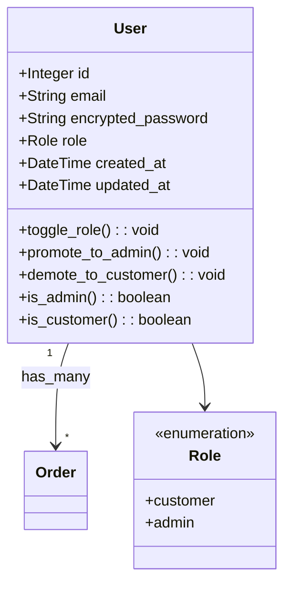

# SaltShop

An Ecommerce Platform heavily inspired by the shopify way of development.

---

## Architectural Diagrams





```mermaid
graph TB
    subgraph "Client Layer"
        Browser[Web Browser]
        EmailClient[Email Client]
    end

    subgraph "Presentation Layer - Rails Views"
        HomeView[Home/Landing Page]
        ProductView[Product Catalog]
        CartView[Shopping Cart]
        CheckoutView[Checkout Flow]
        OrderView[Order Management]
        AdminDashboard[Admin Dashboard]
        UserAuth[Login/Registration]
        MailerViews[Email Templates]
    end

    subgraph "Application Layer - Rails Controllers"
        HomeCtrl[HomeController]
        ProductCtrl[ProductsController]
        CartCtrl[CartsController]
        CartItemCtrl[CartItemsController]
        CheckoutCtrl[CheckoutsController]
        OrderCtrl[OrdersController]
        SessionCtrl[SessionsController]
        UserCtrl[UsersController]
        CustomerCtrl[CustomersController]
        
        subgraph "Admin Namespace"
            AdminDashCtrl[Admin::DashboardController]
            AdminProductCtrl[Admin::ProductsController]
        end
    end

    subgraph "Service Layer"
        ApplicationMailer[ApplicationMailer<br/>Email Service]
        MailerJobs[Email Background Jobs]
    end

    subgraph "Business Logic Layer - Models"
        User[User Model<br/>Authentication & Roles]
        Customer[Customer Model<br/>Customer Profile]
        AdminUser[AdminUser Model<br/>Seller/Admin Profile]
        Role[Role Model<br/>RBAC]
        Product[Product Model<br/>Inventory]
        Cart[Cart Model<br/>Session Cart]
        CartItem[CartItem Model<br/>Cart Line Items]
        Order[Order Model<br/>Order Processing]
        OrderItem[OrderItem Model<br/>Order Line Items]
        
        subgraph "Active Storage Models"
            ASBlob[ActiveStorage::Blob<br/>File Metadata]
            ASAttachment[ActiveStorage::Attachment<br/>Polymorphic Links]
            ASVariant[ActiveStorage::VariantRecord<br/>Image Variants]
        end
    end

    subgraph "Data Layer"
        PostgreSQL[(PostgreSQL 17<br/>Database)]
        RedisCache[(Redis Cache<br/>Sessions/Jobs)]
    end

    subgraph "External Services"
        FileStorage[Cloud Storage<br/>S3/Azure/GCS<br/>Images & Files]
        SMTP[SMTP Server<br/>Email Delivery]
    end

    %% Client to Views
    Browser --> HomeView
    Browser --> ProductView
    Browser --> CartView
    Browser --> CheckoutView
    Browser --> OrderView
    Browser --> AdminDashboard
    Browser --> UserAuth
    EmailClient -.-> MailerViews

    %% Views to Controllers
    HomeView --> HomeCtrl
    ProductView --> ProductCtrl
    CartView --> CartCtrl
    CartView --> CartItemCtrl
    CheckoutView --> CheckoutCtrl
    OrderView --> OrderCtrl
    UserAuth --> SessionCtrl
    UserAuth --> UserCtrl
    AdminDashboard --> AdminDashCtrl
    AdminDashboard --> AdminProductCtrl

    %% Controllers to Models
    HomeCtrl --> Product
    ProductCtrl --> Product
    CartCtrl --> Cart
    CartItemCtrl --> CartItem
    CheckoutCtrl --> Cart
    CheckoutCtrl --> Order
    CheckoutCtrl --> ApplicationMailer
    OrderCtrl --> Order
    OrderCtrl --> ApplicationMailer
    SessionCtrl --> User
    UserCtrl --> User
    UserCtrl --> Customer
    UserCtrl --> AdminUser
    UserCtrl --> ApplicationMailer
    CustomerCtrl --> Customer
    AdminDashCtrl --> Product
    AdminDashCtrl --> Order
    AdminProductCtrl --> Product

    %% Mailer Layer
    ApplicationMailer --> MailerJobs
    ApplicationMailer --> MailerViews
    MailerJobs --> SMTP

    %% Model Relationships
    User --> Role
    User --> Customer
    User --> AdminUser
    Customer --> Cart
    Customer --> Order
    Cart --> CartItem
    CartItem --> Product
    Order --> OrderItem
    OrderItem --> Product
    AdminUser --> Product

    %% Active Storage Relationships
    Product --> ASAttachment
    User --> ASAttachment
    Customer --> ASAttachment
    AdminUser --> ASAttachment
    Role --> ASAttachment
    ASAttachment --> ASBlob
    ASBlob --> ASVariant

    %% Models to Data Layer
    User --> PostgreSQL
    Customer --> PostgreSQL
    AdminUser --> PostgreSQL
    Role --> PostgreSQL
    Product --> PostgreSQL
    Cart --> PostgreSQL
    CartItem --> PostgreSQL
    Order --> PostgreSQL
    OrderItem --> PostgreSQL
    ASBlob --> PostgreSQL
    ASAttachment --> PostgreSQL
    ASVariant --> PostgreSQL
    
    %% Cache Layer
    MailerJobs --> RedisCache
    SessionCtrl --> RedisCache

    %% Active Storage to External
    ASBlob --> FileStorage

    %% Email Delivery
    SMTP -.-> EmailClient

    style Browser fill:#e1f5ff
    style EmailClient fill:#e1f5ff
    style PostgreSQL fill:#336791,color:#fff
    style RedisCache fill:#dc382d,color:#fff
    style FileStorage fill:#ff9900
    style SMTP fill:#00b0ff
    style ApplicationMailer fill:#cc0000,color:#fff
    style ASBlob fill:#cc0000,color:#fff
    style ASAttachment fill:#cc0000,color:#fff
    style ASVariant fill:#cc0000,color:#fff
    ```

---

## Requirements

1) if windows wsl2 (preferably ubuntu)
2) ruby 3.3.6
3) postgres 17 support

---


